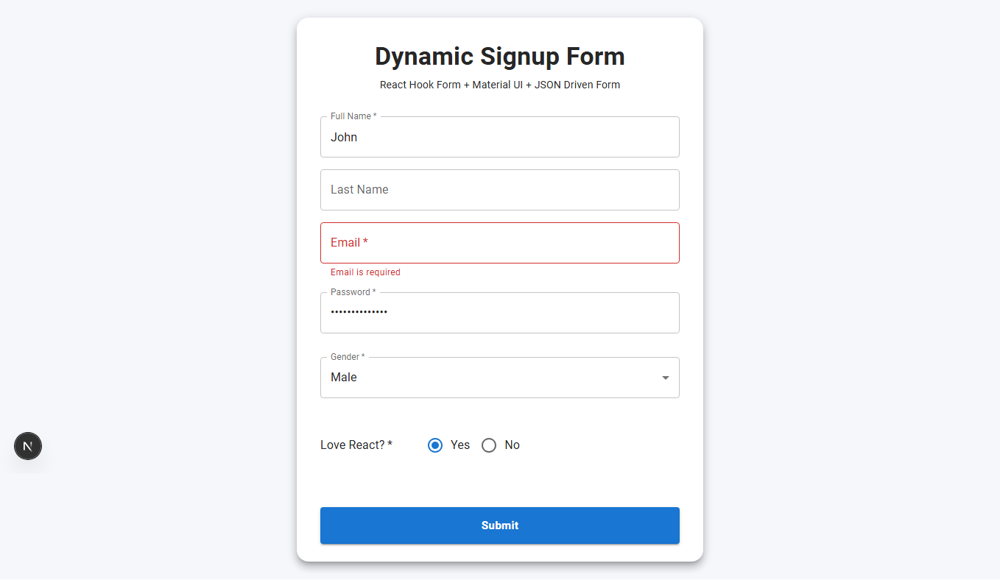

# Dynamic Signup Form

A responsive **Dynamic Signup Form** built with **Next.js**, **TypeScript**, **React Hook Form**, and **Material UI**. The application renders form fields dynamically from a JSON configuration, allowing the UI to adapt automatically when the JSON changes.


## 🚀 Features

* Dynamic form generation from JSON
* React Hook Form validation
* Material UI responsive interface
* Password field support
* Dynamic field rendering based on field type

  * Text
  * Password
  * Dropdown (List)
  * Radio Button
* Required/Optional field support
* Min/Max length validation
* Email validation
* Local Storage persistence
* Responsive design
* Clean, modular, and reusable component architecture

---

## 🛠️ Tech Stack

* Next.js
* TypeScript
* React Hook Form
* Material UI (MUI)

---

# 📁 Project Structure

```text
.
├── data
│   └── form.json          # Dynamic form configuration
├── src
│   ├── app
│   ├── components
│   ├── hooks
│   ├── lib
│   ├── types
│   └── utils
└── README.md
```

---

# 📄 Dynamic JSON Configuration

The form is completely driven by the JSON configuration located at:

```text
data/form.json
```

Simply update the JSON file to:

* Change field labels
* Change field types
* Make fields required or optional
* Update default values
* Add or remove fields
* Modify dropdown options
* Modify radio button options
* Configure validation rules

No UI code changes are required.

---

## ✅ Supported Field Types

| Field Type      | Supported |
| --------------- | --------- |
| TEXT            | ✅         |
| PASSWORD        | ✅         |
| LIST (Dropdown) | ✅         |
| RADIO           | ✅         |

---

## ✅ Validation

The application supports:

* Required fields
* Minimum length
* Maximum length
* Email validation
* Password validation

---

## 💾 Data Persistence

Submitted form data is automatically saved in the browser's **Local Storage** and restored when the application is reopened.

---

# ▶️ Getting Started

## 1. Clone the repository

```bash
git clone https://github.com/prasenjit1011/revest_dynamic_form.git
```

## 2. Navigate to the project

```bash
cd revest_dynamic_form
```

## 3. Install dependencies

```bash
npm install
```

or

```bash
npm i
```

## 4. Run the development server

```bash
npm run dev
```

## 5. Open the application

Browse to:

```text
http://localhost:3000/
```

---

## 📷 Screenshots

Place your screenshots inside:

```text
screenshots/
```

Example:

```text
screenshots/
├── dynamic-form.png
├── validation.png
└── success-message.png
```

---

## 📌 Assignment Highlights

* Dynamic JSON-driven form rendering
* Material UI components
* React Hook Form integration
* Responsive UI
* Local Storage persistence
* Clean and maintainable architecture
* Scalable component-based design

---

<p align="center">
  
</p>

---

## 📄 License

This project was developed as part of a technical assessment for demonstration and learning purposes.
